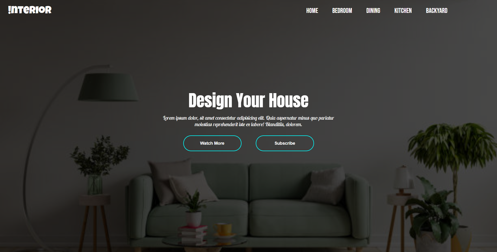

# Foundation Projects – HTML & CSS Basics

This repository contains my **basic frontend projects** created to strengthen my foundation in **HTML and CSS**. These projects focus on building simple, structured, and visually styled pages, helping me understand the core concepts of frontend development.

---

## Projects

### 1. Login Page
- A simple responsive login form.
- Covers **form structure**, **input fields**, **buttons**, and basic layout.
- Styled with **CSS** for alignment, spacing, and clean UI.

### 2. Interior Login Page
- An enhanced login interface with better **design aesthetics**.
- Includes **background layout**, **visual hierarchy**, and refined **typography**.
- Focused on combining structure with design.

---

## 📸 Demo / Screenshot

  

---

## Tech Stack

HTML5 | CSS3
- **HTML5** – structure and semantics.
- **CSS3** – styling, layout, backgrounds, and responsiveness.

---

## Features
- Clean and semantic **HTML structure**.
- **CSS styling** for typography, alignment, spacing, and backgrounds.
- **Responsive design basics** for different screen sizes.
- Practiced creating **reusable UI components** as a base for advanced projects.

---

## Learning Outcomes
- Strengthened understanding of **HTML forms and page structure**.
- Learned to apply **CSS styling and responsive design techniques**.
- Practiced combining **UI design with proper layouting**.
- Built a strong **foundation for future frontend projects**.

---

## Live Preview
Currently, no live deployment is set up.  
You can clone the repo and open the `.html` files directly in your browser.

---

## How to Run
1. Clone this repository:
   ```bash
   git clone https://github.com/Rahumansgit/Foundation.git


2. Navigate to the desired project folder.
3. Open the `.html` file in your browser.

---

## Folder Structure

Foundation/

│── Interior(Login Page)/

│   ├── index.html

│   └── style.css

│

│── Login page/

│   ├── index.html

│   └── style.css

---


Do you want me to also **combine both projects under one main README** (like above), or should I **make two separate README files** (one for Login Page and one for Interior Login Page) inside each folder?
```
